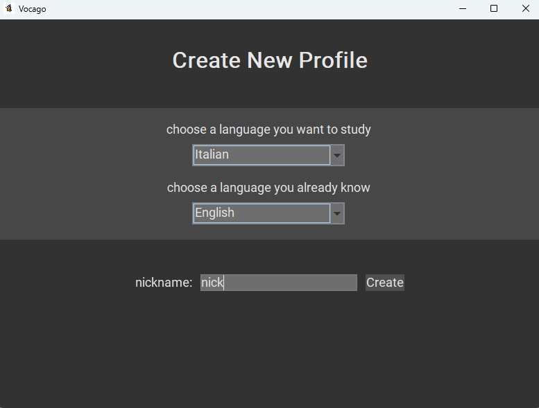
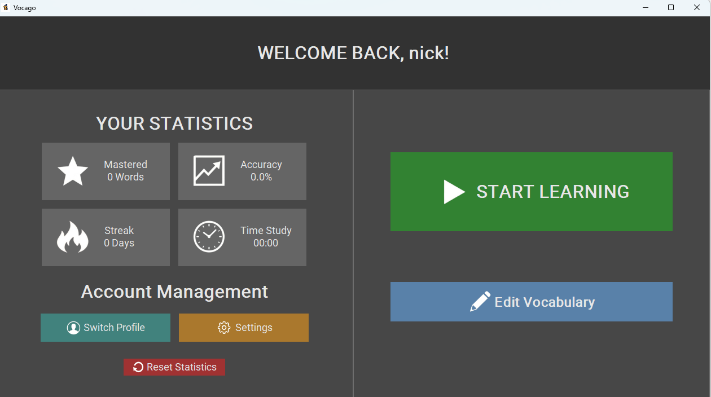
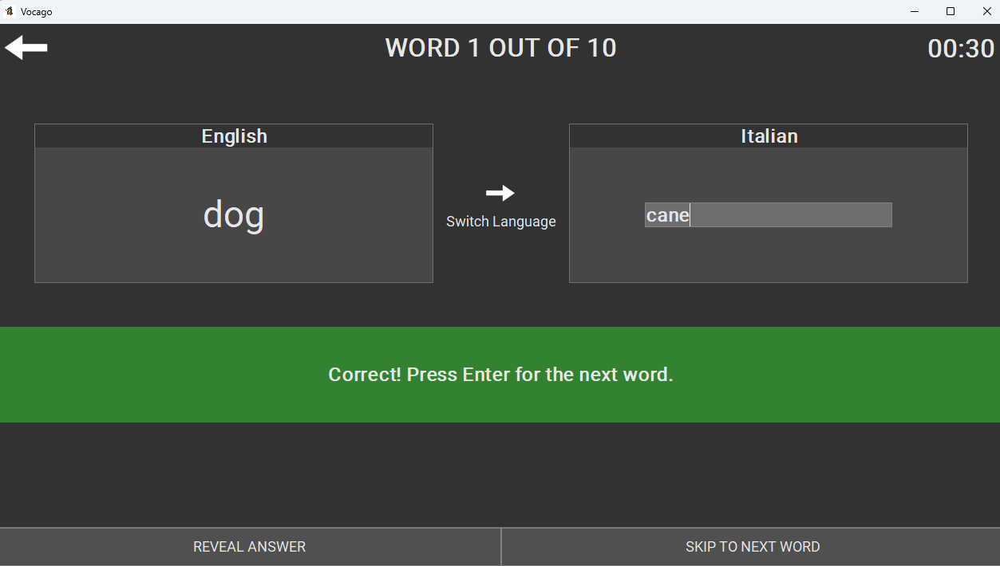
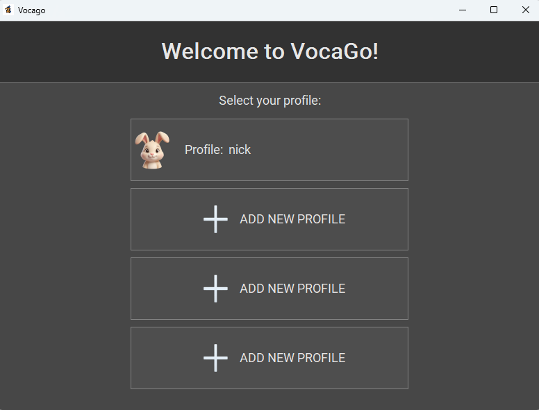
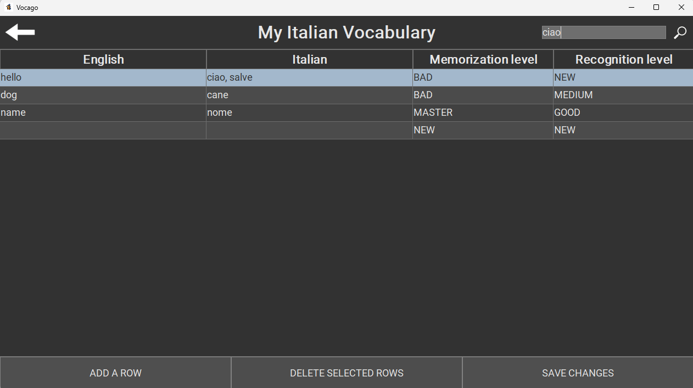

# Vocago

Vocago is a desktop vocabulary-learning application built with
Java 21 and Swing.

## Run on Windows (no Java installation needed)

Download the Windows installer from this repository's [Releases page](https://github.com/DuckLordSupreme/Vocago/releases), then
run `Vocago-1.0.1.exe` and follow the setup steps. Launch Vocago from the Start
menu or desktop shortcut.

Alternatively, download `Vocago-1.0.1-windows-x64.zip`, extract the entire ZIP,
and open `Vocago/Vocago.exe`. Keep the `app` and `runtime` folders beside the EXE.
These packages include Java and target 64-bit Windows (x64).

You can move the installer EXE and the ZIP anywhere. Once extracted, keep the
whole `Vocago` folder together; the portable `Vocago.exe` cannot run by itself.
For local testing before publishing a release, find both downloads in `dist/`.

The packaged app saves profiles and statistics in `%USERPROFILE%\.vocago\profiles`.
To move existing JAR data, close Vocago and copy the files from `data/profiles`
into that folder. Uninstalling the app does not remove this user data.

## Run the JAR

Requires Java 21:

```sh
java -jar OOP25-Vocago-all.jar
```

## Build Windows releases

On Windows, install an x64 JDK 21 with `java` and `jpackage` on PATH. Creating the
installer also requires [WiX 3](https://github.com/wixtoolset/wix3/releases/tag/wix3141rtm)
(`candle.exe` and `light.exe` on PATH, or pass `-WixDirectory` with their folder).
End users do not need these build tools.

Windows packages use `src/main/resources/pictures/wizard.ico`, converted from
the app's wizard artwork. If you replace `wizard.png`, regenerate the Windows
icon with `powershell -ExecutionPolicy Bypass -File scripts/create-windows-icon.ps1`
before packaging.

```powershell
powershell -ExecutionPolicy Bypass -File scripts/package-windows.ps1
```

This runs the build and checks, then creates:

- `dist/Vocago/Vocago.exe`: app folder with a bundled Java runtime.
- `dist/Vocago-1.0.1-windows-x64.zip`: portable distribution.
- `dist/Vocago-1.0.1.exe`: per-user installer with Start menu and desktop shortcuts.

The script refuses to replace an existing app folder. To rebuild this version,
add `-OutputDirectory dist/rebuild-1.0.1` and choose a fresh folder for each run.
For later releases, use `-Version 1.0.2 -OutputDirectory dist/1.0.2`.
Use `-SkipInstaller` to produce only the app folder and ZIP
without WiX. Packaging stages only the built JAR in an isolated folder under
`build/windows-input`.

Before publishing, launch the packaged app and check creating a profile,
practicing, closing, and reopening. Test installation on a clean Windows machine.
The generated installer is unsigned, so Windows may show an unknown-publisher prompt.

## Publish on GitHub

Commit the source code, README, packaging scripts, and wizard icon to the repository.
Generated packages in `dist/` and build tools in `build/` are ignored by Git.

Create a GitHub Release with tag `v1.0.1` and attach these two files from `dist/`
(or the output folder chosen when packaging):

- `Vocago-1.0.1.exe` — Windows installer, recommended for most users.
- `Vocago-1.0.1-windows-x64.zip` — portable app with its bundled Java runtime.

Do not upload only the portable `Vocago.exe`. Users need either the installer
or the complete ZIP. The release downloads become available after you publish
the release and attach the files.

## Features

- Multiple user profiles
- Custom vocabulary collections
- Vocabulary practice
- Progress statistics
- Persistent user data

## Technology

Java 21 · Swing · Gradle · JUnit 5

## Documentation

[Technical Report & User Manual](./Project_Report.pdf)

## Preview






